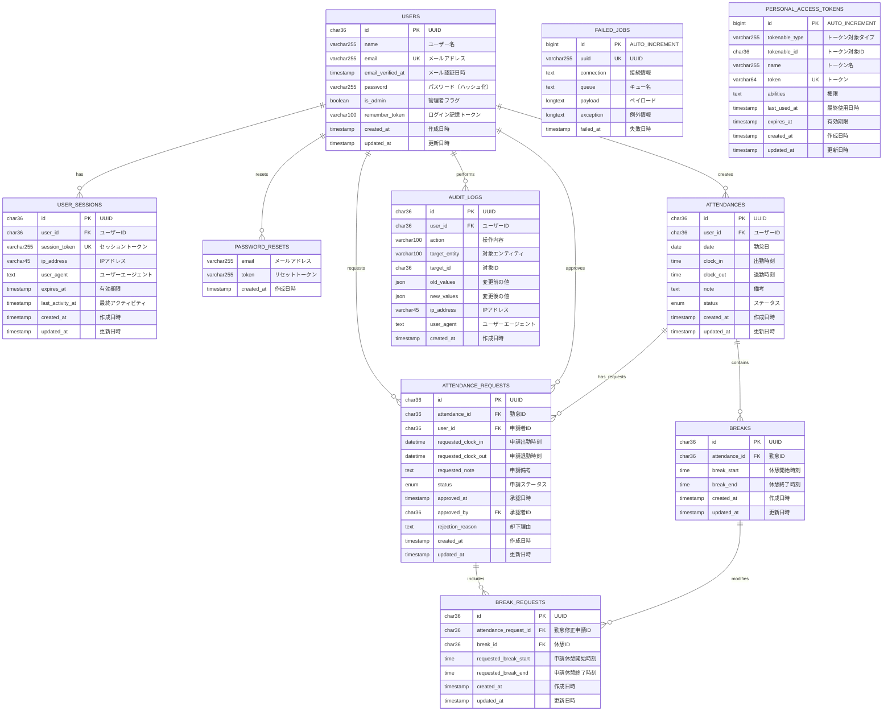

# 勤怠管理システム ER 図

## エンティティ詳細

### USERS（ユーザー）

- **id**: 主キー（UUID）
- **name**: ユーザー名
- **email**: メールアドレス（ユニーク）
- **email_verified_at**: メール認証日時
- **password**: パスワード（ハッシュ化）
- **is_admin**: 管理者フラグ
- **remember_token**: ログイン記憶トークン
- **created_at**: 作成日時
- **updated_at**: 更新日時

### ATTENDANCES（勤怠）

- **id**: 主キー（UUID）
- **user_id**: ユーザー ID（外部キー）
- **date**: 勤怠日
- **clock_in**: 出勤時刻
- **clock_out**: 退勤時刻
- **note**: 備考
- **status**: ステータス（off_duty, working, break, finished）
- **created_at**: 作成日時
- **updated_at**: 更新日時

### BREAKS（休憩）

- **id**: 主キー（UUID）
- **attendance_id**: 勤怠 ID（外部キー）
- **break_start**: 休憩開始時刻
- **break_end**: 休憩終了時刻
- **created_at**: 作成日時
- **updated_at**: 更新日時

### ATTENDANCE_REQUESTS（勤怠修正申請）

- **id**: 主キー（UUID）
- **attendance_id**: 勤怠 ID（外部キー）
- **user_id**: 申請者 ID（外部キー）
- **requested_clock_in**: 申請出勤時刻
- **requested_clock_out**: 申請退勤時刻
- **requested_note**: 申請備考
- **status**: ステータス（pending, approved）
- **approved_at**: 承認日時
- **approved_by**: 承認者 ID（外部キー）
- **created_at**: 作成日時
- **updated_at**: 更新日時

### BREAK_REQUESTS（休憩修正申請）

- **id**: 主キー（UUID）
- **attendance_request_id**: 勤怠修正申請 ID（外部キー）
- **break_id**: 休憩 ID（外部キー）
- **requested_break_start**: 申請休憩開始時刻
- **requested_break_end**: 申請休憩終了時刻
- **created_at**: 作成日時
- **updated_at**: 更新日時

## 関係の詳細

1. **USERS → ATTENDANCES**: 1 対多（1 人のユーザーは複数の勤怠記録を持つ）
2. **ATTENDANCES → BREAKS**: 1 対多（1 つの勤怠記録は複数の休憩記録を持つ）
3. **ATTENDANCES → ATTENDANCE_REQUESTS**: 1 対多（1 つの勤怠記録は複数の修正申請を持つ）
4. **USERS → ATTENDANCE_REQUESTS**: 1 対多（1 人のユーザーは複数の勤怠修正申請を行う）
5. **USERS → ATTENDANCE_REQUESTS**: 1 対多（1 人の管理者は複数の申請を承認する）
6. **ATTENDANCE_REQUESTS → BREAK_REQUESTS**: 1 対多（1 つの勤怠修正申請は複数の休憩修正申請を持つ）
7. **BREAKS → BREAK_REQUESTS**: 1 対多（1 つの休憩記録は複数の休憩修正申請を持つ）
