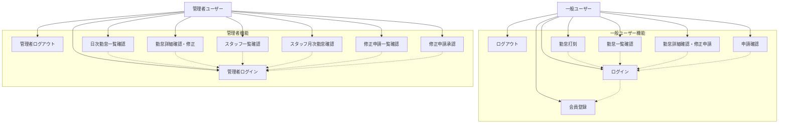

# 勤怠管理システム ユースケース図

## ユースケース詳細

### 一般ユーザー（US001-US009）
- **US001**: 新規一般ユーザーは、システムの一般機能に会員登録することができる
- **US002**: 一般ユーザーは、システムの一般機能にログインすることができる
- **US003**: 一般ユーザーは、システムの一般機能からログアウトすることができる
- **US006**: 一般ユーザーは、勤怠の打刻をすることができる
- **US007**: 一般ユーザーは、勤怠一覧を確認することができる
- **US008**: 一般ユーザーは、勤怠詳細を確認・修正申請することができる
- **US009**: 一般ユーザーは、自分が行った申請を確認することができる

### 管理者ユーザー（US004-US005, US010-US015）
- **US004**: 管理者ユーザーは、システムの管理機能にログインすることができる
- **US005**: 管理者ユーザーは、管理機能からログアウトすることができる
- **US010**: 管理者ユーザーは日次勤怠一覧を確認することができる
- **US011**: 管理者ユーザーは各勤怠の詳細を確認・修正することができる
- **US012**: 管理者ユーザーはスタッフ一覧を確認することができる
- **US013**: 管理者ユーザーはスタッフ毎の月次勤怠一覧を確認することができる
- **US014**: 管理者ユーザーは修正申請一覧を確認することができる
- **US015**: 管理者ユーザーは修正申請の詳細を確認・承認することができる
